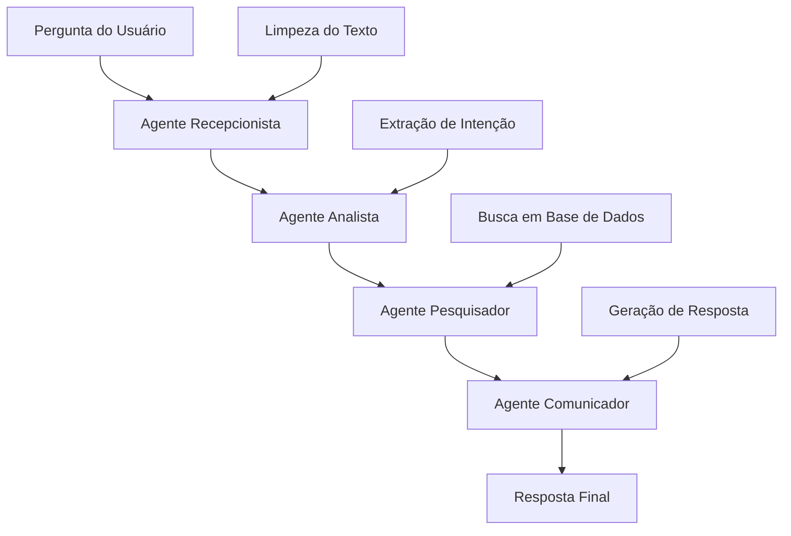

# Aula 4 - Cadeia de Agentes Especializados

## 🎯 Objetivo da Aula

Aprender a criar **agentes especializados** que trabalham em **sequência**, onde cada agente tem uma responsabilidade específica e bem definida. Esta abordagem é fundamental para criar sistemas complexos e escaláveis.

## 🧠 Conceitos Fundamentais

### Por que usar Cadeia de Agentes?

1. **Especialização**: Cada agente foca em uma tarefa específica
2. **Clareza**: Responsabilidades bem definidas
3. **Manutenibilidade**: Fácil de debugar e modificar
4. **Escalabilidade**: Pode adicionar/remover agentes conforme necessário
5. **Qualidade**: Cada etapa é otimizada para sua função

### Padrão de Arquitetura

```
Entrada → Agente 1 → Agente 2 → Agente 3 → Agente 4 → Saída Final
```

## 🏗️ Os 4 Agentes do Sistema

### 1. 🏢 Agente de Saudação e Triagem (O Recepcionista)

**Responsabilidade**: Primeira linha de contato

- **Recebe**: Pergunta bruta do usuário
- **Processa**: Limpeza e padronização do texto
- **Entrega**: Pergunta limpa e clara

**Exemplo**:

- Entrada: `"e aí, queria saber o preço daquele negócio novo"`
- Saída: `"Cliente quer saber o preço de um produto novo"`

### 2. 🔍 Agente de Extração de Intenção (O Analista)

**Responsabilidade**: Compreender o que o usuário realmente quer

- **Recebe**: Pergunta limpa do Agente 1
- **Processa**: Análise e categorização da intenção
- **Entrega**: Estrutura JSON com intenção e entidades

**Exemplo**:

```json
{
    "intencao": "consultar_preco",
    "produto": "notebook gamer",
    "contexto": "cliente interessado em compra"
}
```

### 3. 📊 Agente de Busca de Informação (O Pesquisador)

**Responsabilidade**: Localizar informações específicas

- **Recebe**: Intenção estruturada do Agente 2
- **Processa**: Busca em banco de dados/APIs/RAG
- **Entrega**: Informações factuais e precisas

**Exemplo**:

- Entrada: `{"intencao": "consultar_preco", "produto": "notebook gamer"}`
- Saída: `"Notebook Gamer Ultra X1 - R$ 2.999,90 - 15 unidades em estoque"`

### 4. 💬 Agente de Geração de Resposta (O Comunicador)

**Responsabilidade**: Transformar dados em resposta humana

- **Recebe**: Informações factuais do Agente 3
- **Processa**: Geração de resposta amigável e útil
- **Entrega**: Texto final para o usuário

**Exemplo**:

- Entrada: `"Notebook Gamer Ultra X1 - R$ 2.999,90 - 15 unidades em estoque"`
- Saída: `"Olá! O Notebook Gamer Ultra X1 está disponível por R$ 2.999,90 e temos 15 unidades em estoque. Posso ajudar com mais alguma informação?"`

## 🚀 Como Executar

```bash
# Instalar dependências
pip install crewai langchain-openai

# Configurar API key
export OPENAI_API_KEY="sua_chave_aqui"

# Executar o exemplo
python main.py
```

## 📋 Opções de Execução

1. **Exemplos Pré-definidos**: Demonstra diferentes tipos de perguntas
2. **Pergunta Personalizada**: Teste com suas próprias perguntas

## 🔄 Fluxo Completo



## 💡 Vantagens desta Abordagem

### ✅ Benefícios

- **Modularidade**: Cada agente pode ser testado independentemente
- **Especialização**: Cada agente é expert em sua função
- **Flexibilidade**: Fácil modificar um agente sem afetar outros
- **Debugabilidade**: Pode verificar saída de cada etapa
- **Escalabilidade**: Pode adicionar novos agentes na cadeia

### 🎯 Casos de Uso Ideais

- **Sistemas de Atendimento**: Como demonstrado no exemplo
- **Pipelines de Processamento**: Análise de documentos, dados
- **Workflows Complexos**: E-commerce, automação de processos
- **Sistemas de Decisão**: Análise → Pesquisa → Recomendação

## 🛠️ Customizações Possíveis

### Adicionar Novos Agentes

```python
# Exemplo: Agente de Validação entre Analista e Pesquisador
agente_validacao = Agent(
    role="Validador de Consultas",
    goal="Verificar se a intenção extraída está correta",
    backstory="Especialista em validar se a análise está precisa..."
)
```

### Modificar o Fluxo

```python
# Processo paralelo para algumas tarefas
process=Process.hierarchical  # Hierárquico
process=Process.sequential    # Sequencial (padrão)
```

### Adicionar Ferramentas

```python
from crewai_tools import WebSearchTool, FileReadTool

# Agente com ferramentas específicas
agente_pesquisa = Agent(
    # ... configurações ...
    tools=[WebSearchTool(), FileReadTool()]
)
```

## 📚 Conceitos Avançados

### Context Sharing

Os agentes compartilham contexto através do parâmetro `context` nas tarefas:

```python
tarefa_2 = Task(
    # ... configurações ...
    context=[tarefa_1]  # Recebe output da tarefa_1
)
```

### Expected Output

Definir claramente o que cada tarefa deve entregar:

```python
expected_output="JSON estruturado com intenção, produto e contexto"
```

### Verbose Mode

Ativar para ver o processo de raciocínio:

```python
Agent(verbose=True)  # Mostra pensamento do agente
Crew(verbose=True)   # Mostra processo da equipe
```

## 🎓 Exercícios Práticos

1. **Modificar Base de Dados**: Adicione mais produtos
2. **Novo Agente**: Crie um agente de recomendação
3. **Diferentes Intenções**: Adicione suporte a reclamações
4. **Integração Externa**: Conecte com API real
5. **Melhorar Análise**: Use regex ou NLP para extração

## 🔍 Debugging e Troubleshooting

### Problemas Comuns

1. **Agente não entende intenção**: Melhorar backstory
2. **Formato de saída incorreto**: Ser mais específico no expected_output
3. **Informação perdida**: Verificar context entre tarefas

### Dicas de Debug

```python
# Verificar saída de cada tarefa
print(f"Tarefa 1: {tarefa_recepcao.output}")
print(f"Tarefa 2: {tarefa_analise.output}")
```

## 🎯 Próximos Passos

Depois de dominar esta aula, você pode:

1. Criar cadeias mais complexas (5+ agentes)
2. Implementar ramificações condicionais
3. Adicionar persistência de dados
4. Integrar com sistemas externos
5. Criar interfaces web/chat

---

*Esta aula demonstra o poder da especialização em sistemas multi-agentes. Cada agente faz uma coisa muito bem, e juntos criam uma solução robusta e escalável.*
