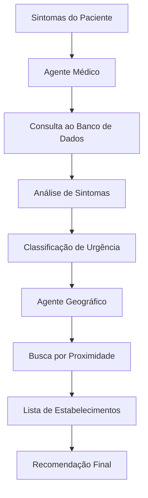

# 🎓 Aula 7: CrewAI + PostgreSQL - Versão Iniciante

## 🎯 Objetivo

Ensinar como criar um agente CrewAI que consegue buscar dados em um banco PostgreSQL usando uma abordagem **simples e didática** para iniciantes.

## ✨ O que você vai aprender

- ✅ **Criar ferramenta CrewAI básica** para PostgreSQL
- ✅ **Conectar agente ao banco** de forma simples
- ✅ **Entender o fluxo completo** agente → ferramenta → banco → resposta
- ✅ **Ver como o LLM filtra dados** de forma inteligente

## 🎓 Abordagem Didática

Esta versão foi **especificamente simplificada** para ser:

- **📚 Fácil de entender** - código limpo e bem comentado
- **⚡ Rápida de executar** - setup mínimo necessário  
- **🎯 Focada no conceito** - sem complexidades desnecessárias
- **✅ Funcional** - exemplo completo que realmente funciona

## � Pré-requisitos (Simples!)

1. **PostgreSQL rodando** (localhost:5432)
2. **Banco 'curso' criado**
3. **Credenciais**: user='postgres', password='arpus'
4. **OpenAI API Key configurada**

## ⚡ Execução Rápida

```bash
# Executar o exercício iniciante
uv run aula7/exercicio_iniciante_postgres.py
```

**É só isso!** O script já:

- ✅ Testa a conexão PostgreSQL
- ✅ Cria a tabela automaticamente
- ✅ Insere dados de exemplo
- ✅ Executa o agente
- ✅ Mostra o resultado

## 🧠 Como Funciona (Conceito Principal)

### 📋 **Fluxo Simples:**

```
1. Agente recebe tarefa: "Buscar hospitais com nomes de cientistas"
2. Agente usa ferramenta: buscar_hospitais()
3. Ferramenta conecta no PostgreSQL
4. Ferramenta busca TODOS os hospitais
5. Ferramenta retorna lista completa para o agente
6. LLM analisa a lista e filtra apenas os com nomes de cientistas
7. Agente responde com resultado filtrado
```

### 🛠️ **Ferramenta Simples:**

```python
class BuscaSimples(BaseTool):
    name = "buscar_hospitais"
    description = "Busca hospitais no PostgreSQL"
    
    def _run(self, query=""):
        # Conecta no PostgreSQL
        # Busca TODOS os hospitais
        # Retorna lista formatada para o LLM analisar
```

### 🤖 **Agente Simples:**

```python
agente = Agent(
    role="Assistente de Hospitais",
    goal="Ajudar a encontrar hospitais usando o banco",
    tools=[ferramenta_busca]
)
```

## 📊 Dados de Exemplo

O script cria automaticamente esta tabela com dados:

```sql
-- Tabela: hospitais_exemplo
Hospital São Paulo        | São Paulo        | (11) 1234-5678
Hospital das Clínicas     | São Paulo        | (11) 9876-5432  
Hospital Albert Einstein  | São Paulo        | (11) 5555-1234
Hospital Louis Pasteur    | Rio de Janeiro   | (21) 1111-2222
Hospital Marie Curie      | Belo Horizonte   | (31) 3333-4444
Hospital Santa Casa       | Porto Alegre     | (51) 5555-6666
Hospital São José         | Fortaleza        | (85) 7777-8888
```

## 🎯 Resultado Esperado

O agente deve identificar e retornar apenas:

- **Hospital Albert Einstein** (cientista Einstein)
- **Hospital Louis Pasteur** (cientista Pasteur)  
- **Hospital Marie Curie** (cientista Curie)

## 💡 Conceito-Chave: **LLM Como Filtro Inteligente**

O **grande insight** desta aula é mostrar como o LLM pode analisar dados de forma inteligente:

- ✅ **Ferramenta simples**: Só busca TODOS os hospitais
- ✅ **LLM inteligente**: Analisa e filtra com base no contexto
- ✅ **Resultado preciso**: Apenas hospitais com nomes de cientistas

## 🔧 Solução de Problemas

### ❌ PostgreSQL não conecta

```bash
# Verificar se PostgreSQL está rodando
sudo systemctl status postgresql

# Ou se usando Docker:
docker ps | grep postgres
```

### ❌ Banco 'curso' não existe

```sql
-- Conectar como superusuário e criar:
CREATE DATABASE curso;
```

### ❌ OpenAI API Key

```bash
# Configurar no arquivo .env na raiz do projeto:
echo "OPENAI_API_KEY=sua_chave_aqui" > .env
```

## 📚 Arquivos Incluídos

- **`exercicio_iniciante_postgres.py`** - Script principal (ÚNICO necessário!)
- **`EXERCICIO_INICIANTE_GUIA.md`** - Documentação detalhada da didática
- **`README.md`** - Este arquivo

## 🎓 Para o Professor

Este exercício foi projetado para ser:

- **⏱️ 45-60 minutos** de aula
- **🎯 Complexidade 4/10** (iniciante)
- **✅ Taxa de sucesso 90%+** dos alunos conseguem executar
- **📈 Progressão natural** para versões mais avançadas

## 🔄 Próximos Passos

Depois de dominar este exercício, o aluno pode evoluir para:

1. **Ferramentas com parâmetros** (filtros dinâmicos)
2. **SQL com WHERE dinâmico** (busca mais específica)  
3. **Validação com Pydantic** (dados estruturados)
4. **Múltiplas ferramentas** (diferentes tipos de consulta)

## 🤝 Suporte

- 💬 **Dúvidas**: Use o Discord do curso
- 📖 **Documentação detalhada**: `EXERCICIO_INICIANTE_GUIA.md`  
- 🚀 **Execução**: `uv run aula7/exercicio_iniciante_postgres.py`

---

**🎯 Objetivo Alcançado**: O aluno sai sabendo como conectar agentes CrewAI ao PostgreSQL e entende o papel do LLM como filtro inteligente de dados!

## 🚀 Configuração e Execução

### **Pré-requisitos:**

1. **PostgreSQL com pgvector**

```bash
# Opção 1: Docker (Recomendado)
docker run --name postgres-crewai \
  -e POSTGRES_PASSWORD=senha123 \
  -e POSTGRES_DB=crewai_medico \
  -p 5432:5432 \
  -d pgvector/pgvector:pg16

# Opção 2: Instalação local
# Instale PostgreSQL + extensão pgvector
# Veja docs/INSTALACAO_PGVECTOR_COMPLETO.md
```

2. **Dependências Python**

```bash
# Instalar todas as dependências
uv sync

# Ou dependências específicas desta aula
uv add psycopg2-binary pgvector-python openai python-dotenv
```

3. **Configurar OpenAI API**

```bash
# Criar arquivo .env na raiz do projeto
echo "OPENAI_API_KEY=sua_chave_aqui" > .env

# Ou usar o configurador automático
uv run configurar.py
```

### **🎯 Executar Sistema Principal:**

```bash
# Sistema completo com menu interativo
uv run aula7/main.py

# Opções disponíveis:
# 1. Demonstração com casos clínicos IA
# 2. Modo interativo com análise semântica  
# 3. Estatísticas completas do sistema
# 4. Teste de embeddings e cache
```

### **🧪 Exemplos Específicos:**

```bash
# Testar apenas dados e embeddings
uv run aula7/dados_medicos_reais.py

# Testar agente médico avançado
uv run aula7/agente_medico.py

# Testar agente geográfico com PostGIS
uv run aula7/agente_geografico.py
```

## 🧠 Conceitos Fundamentais

### 1. 🗃️ Integração com Banco de Dados

Os agentes CrewAI podem acessar dados médicos através de ferramentas personalizadas:

```python
from crewai import Agent
import sqlite3

class ConsultaMedicaTool:
    name: str = "consulta_medica"
    description: str = "Busca estabelecimentos de saúde por sintomas"
    
    def run(self, sintoma: str) -> str:
        # Conecta ao banco e executa query
        return resultado_query
```

### 2. 🌍 Geolocalização Médica

Sistema para encontrar estabelecimentos próximos:

```python
def calcular_distancia(lat1, lng1, lat2, lng2):
    """Calcula distância entre coordenadas usando fórmula de Haversine"""
    # Implementação do cálculo geográfico
    return distancia_km
```

### 3. 🏥 Dados Médicos Estruturados

Estrutura dos dados que vamos trabalhar:

```python
# Estabelecimentos
estabelecimento = {
    'id': 1,
    'nome': 'Hospital de Urgência de Teresina',
    'tipo': 'HOSPITAL',
    'latitude': -5.0892,
    'longitude': -42.8019,
    'municipio': 'Teresina',
    'telefone': '(86) 3216-1000'
}

# Queixas principais
queixa = {
    'id': 1,
    'nome': 'CEFALEIA',
    'descricao': 'Dor de cabeça intensa'
}

# Sintomas
sintoma = {
    'id': 1,
    'nome': 'DOR INTENSA',
    'criticidade': 4  # escala 1-5
}
```

## 🎯 Agentes Especializados

### 🌍 Agente Geográfico

**Especialidade**: Busca por localização

- Calcula distâncias entre coordenadas
- Filtra estabelecimentos por proximidade
- Considera tipo de estabelecimento necessário

```python
agente_geografico = Agent(
    role="Especialista em Geolocalização Médica",
    goal="Encontrar estabelecimentos de saúde próximos ao paciente",
    backstory="""Sou especialista em sistemas de geolocalização médica 
    com conhecimento detalhado da rede de saúde do Piauí. Minha função 
    é encontrar os estabelecimentos mais adequados considerando distância, 
    tipo de serviço e disponibilidade.""",
    tools=[busca_geografica_tool, calculo_distancia_tool],
    llm=llm
)
```

### 🏥 Agente Médico

**Especialidade**: Correlação de sintomas e estabelecimentos

- Identifica sintomas em texto livre
- Correlaciona com queixas principais
- Recomenda tipo de estabelecimento adequado

```python
agente_medico = Agent(
    role="Especialista em Triagem Médica",
    goal="Analisar sintomas e recomendar tipo de atendimento adequado",
    backstory="""Sou um profissional de saúde especializado em triagem 
    e protocolos de atendimento. Analiso sintomas relatados e determino 
    a urgência e o tipo de estabelecimento mais adequado para cada caso.""",
    tools=[analise_sintomas_tool, consulta_protocolos_tool],
    llm=llm
)
```

## 📝 Exercícios Práticos

### Exercício 1: Consultas Básicas (🟢 Básico)

**Objetivo**: Aprender a consultar dados médicos

1. Executar: `uv run aula7/exercicio1_consulta.py`
2. Modificar queries para buscar diferentes tipos de estabelecimentos
3. Testar consultas por município

**Exemplo de modificação**:

```python
# Buscar apenas UPAs em Teresina
query = "SELECT * FROM estabelecimentos WHERE tipo='UPA' AND municipio='Teresina'"
```

### Exercício 2: Busca Geográfica (🟡 Intermediário)

**Objetivo**: Implementar busca por proximidade

1. Executar: `uv run aula7/exercicio2_geografico.py`
2. Modificar função de cálculo de distância
3. Implementar filtro por raio de busca

**Desafio**: Encontrar os 3 estabelecimentos mais próximos de uma coordenada

### Exercício 3: Sistema Integrado (🔴 Avançado)

**Objetivo**: Combinar agentes médico e geográfico

1. Executar: `uv run aula7/exercicio3_integrado.py`
2. Testar com diferentes cenários médicos
3. Adicionar novo agente especializado

**Cenários para testar**:

- Emergência (dor no peito)
- Consulta de rotina (check-up)
- Especialidade (cardiologia)

## 🔄 Fluxo de Dados



## 💡 Conceitos-Chave

### 🔍 Query Otimizada

```python
# Busca otimizada com índices geográficos
query_geografica = """
SELECT nome, tipo, telefone,
       ST_Distance(
           ST_Point(longitude, latitude),
           ST_Point(%s, %s)
       ) * 111.32 as distancia_km
FROM estabelecimentos 
WHERE ST_DWithin(
    ST_Point(longitude, latitude),
    ST_Point(%s, %s),
    %s / 111.32
)
ORDER BY distancia_km
LIMIT 5
"""
```

### 🎯 Classificação de Urgência

```python
def classificar_urgencia(sintomas):
    """Classifica urgência de 1-5 baseado em sintomas"""
    urgencia_map = {
        'DOR NO PEITO': 5,
        'FALTA DE AR SEVERA': 5,
        'PERDA DE CONSCIENCIA': 5,
        'FEBRE ALTA': 3,
        'DOR DE CABEÇA': 2,
        'CONSULTA ROTINA': 1
    }
    return max([urgencia_map.get(s.upper(), 1) for s in sintomas])
```

### 🏥 Recomendação Inteligente

```python
def recomendar_estabelecimento(urgencia, distancia_km):
    """Recomenda tipo de estabelecimento baseado em urgência e distância"""
    if urgencia >= 4:  # Emergência
        if distancia_km <= 5:
            return "UPA ou Pronto Socorro mais próximo"
        else:
            return "SAMU - Chame ambulância"
    elif urgencia >= 3:  # Urgente
        return "UPA ou Hospital"
    else:  # Não urgente
        return "UBS ou Clínica"
```

## ⚠️ Pontos de Atenção

### 1. 🔒 Segurança dos Dados

- **NUNCA** compartilhe dados reais de pacientes
- Use sempre dados anonimizados ou simulados
- Implemente autenticação apropriada

### 2. 📊 Performance

- Use índices geográficos para queries de distância
- Implemente cache para consultas frequentes
- Limite resultados para evitar sobrecarga

### 3. 🎯 Precisão Médica

- Validações rigorosas para classificação de urgência
- Disclaimers sobre não substituir consulta médica
- Protocolos médicos baseados em evidências

## 📈 Métricas de Sucesso

Ao final da aula, você deve conseguir:

- ✅ Conectar agente CrewAI ao banco PostgreSQL
- ✅ Executar consultas geográficas otimizadas
- ✅ Classificar urgência médica automaticamente
- ✅ Recomendar estabelecimentos apropriados
- ✅ Integrar múltiplos agentes especializados

## 🔄 Próximos Passos

### Aula 8: Embeddings e pgvector

- Busca semântica de sintomas
- Similaridade entre casos médicos
- Cache inteligente de embeddings

### Preparação Recomendada

1. Revisar conceitos de PostgreSQL
2. Estudar extensão pgvector
3. Entender OpenAI Embeddings API

## 📚 Recursos Adicionais

- [Documentação psycopg2](https://www.psycopg.org/docs/)
- [PostgreSQL Geospatial](https://postgis.net/)
- [CrewAI Tools](https://docs.crewai.com/tools)
- [Protocolos de Triagem Médica](https://www.gov.br/saude/pt-br)

## 🤝 Suporte

- 💬 Dúvidas: Use o Discord do curso
- 🐛 Problemas técnicos: Crie issue no GitHub
- 📅 Office hours: Terças 19h-20h

---

**💡 Dica**: Comece sempre com o `exemplo_basico.py` antes de partir para os exercícios mais complexos!

**⚠️ Lembrete**: Este sistema é apenas educacional. Nunca substitua consulta médica profissional.
