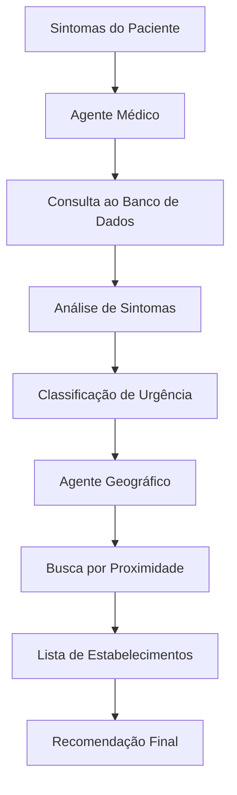

# Aula 7: Integração PostgreSQL e CrewAI - Dados Médicos Reais

## 🎯 Objetivos da Aula

- Conectar agentes CrewAI ao banco de dados PostgreSQL com dados médicos
- Implementar consultas otimizadas em sistemas médicos
- Criar agentes especializados em consultas geográficas e médicas
- Implementar sistema de busca por estabelecimentos de saúde próximos

## � Escopo Educacional da Aula

### **O que os alunos aprenderão:**

- ✅ **Integração CrewAI + Dados Estruturados**: Como conectar agentes a fontes de dados
- ✅ **Consultas em Sistemas Médicos**: Queries otimizadas para dados de saúde
- ✅ **Geolocalização Médica**: Busca por proximidade e cálculos geográficos
- ✅ **Classificação de Urgência**: Algoritmos para priorização médica
- ✅ **Múltiplos Agentes Especializados**: Orquestração de agentes médicos e geográficos

### **Implementação Didática:**

- 🗄️ **Dados Simulados**: SQLite em memória para aprendizado prático
- 📊 **Baseado na Realidade**: Estrutura real do sistema de saúde do Piauí
- 🎯 **Preparação para Produção**: Conceitos aplicáveis ao PostgreSQL real (Aula 8)
- 📚 **Exercícios Progressivos**: Do básico ao avançado

## 🏥 Contexto: Sistema Médico Simulado

Esta aula usa dados simulados baseados no sistema real de saúde do Piauí:

- **10 estabelecimentos de saúde** para demonstração prática
- **10 queixas principais** (CEFALEIA, DOR NO PEITO, FEBRE, etc.)
- **10 sintomas médicos** (DOR INTENSA, FEBRE ALTA, NÁUSEA, etc.)
- **Coordenadas reais** de Teresina para cálculos geográficos

## 📁 Estrutura da Aula

```
aula7/
├── README.md                    # Este arquivo
├── main.py                      # Exemplo principal completo
├── config_database.py           # Configuração do banco PostgreSQL
├── dados_simulados.py           # Dados médicos para simulação
├── agente_geografico.py         # Agente especializado em geolocalização
├── agente_medico.py            # Agente especializado em dados médicos
├── exemplo_basico.py           # Exemplo simples para começar
├── exercicio1_consulta.py      # Exercício: consultas básicas
├── exercicio2_geografico.py    # Exercício: busca geográfica
└── exercicio3_integrado.py     # Exercício: sistema completo
```

## 🚀 Como Executar

⚠️ **IMPORTANTE**: Este projeto usa UV para gerenciamento de dependências.

### 1. Instalar Dependências

```bash
# Instalar dependências do projeto
uv sync

# Ou instalar dependências específicas desta aula
uv add psycopg2-binary pandas geopy
```

### 2. Configurar Banco PostgreSQL (Simulado)

Para fins didáticos, vamos simular o banco usando dados em memória:

```bash
# Executar exemplo básico (dados simulados)
uv run aula7/exemplo_basico.py

# Executar exemplo principal
uv run aula7/main.py
```

### 3. Extensão para PostgreSQL Real (Conceitual)

Esta aula demonstra os conceitos que serão aplicados com PostgreSQL real:

```bash
# Os conceitos aprendidos aqui serão aplicados na Aula 8 com:
# - PostgreSQL real com pgvector
# - OpenAI Embeddings
# - Busca semântica avançada
```

## 🧠 Conceitos Fundamentais

### 1. 🗃️ Integração com Banco de Dados

Os agentes CrewAI podem acessar dados médicos através de ferramentas personalizadas:

```python
from crewai import Agent
import sqlite3

class ConsultaMedicaTool:
    name: str = "consulta_medica"
    description: str = "Busca estabelecimentos de saúde por sintomas"
    
    def run(self, sintoma: str) -> str:
        # Conecta ao banco e executa query
        return resultado_query
```

### 2. 🌍 Geolocalização Médica

Sistema para encontrar estabelecimentos próximos:

```python
def calcular_distancia(lat1, lng1, lat2, lng2):
    """Calcula distância entre coordenadas usando fórmula de Haversine"""
    # Implementação do cálculo geográfico
    return distancia_km
```

### 3. 🏥 Dados Médicos Estruturados

Estrutura dos dados que vamos trabalhar:

```python
# Estabelecimentos
estabelecimento = {
    'id': 1,
    'nome': 'Hospital de Urgência de Teresina',
    'tipo': 'HOSPITAL',
    'latitude': -5.0892,
    'longitude': -42.8019,
    'municipio': 'Teresina',
    'telefone': '(86) 3216-1000'
}

# Queixas principais
queixa = {
    'id': 1,
    'nome': 'CEFALEIA',
    'descricao': 'Dor de cabeça intensa'
}

# Sintomas
sintoma = {
    'id': 1,
    'nome': 'DOR INTENSA',
    'criticidade': 4  # escala 1-5
}
```

## 🎯 Agentes Especializados

### 🌍 Agente Geográfico

**Especialidade**: Busca por localização

- Calcula distâncias entre coordenadas
- Filtra estabelecimentos por proximidade
- Considera tipo de estabelecimento necessário

```python
agente_geografico = Agent(
    role="Especialista em Geolocalização Médica",
    goal="Encontrar estabelecimentos de saúde próximos ao paciente",
    backstory="""Sou especialista em sistemas de geolocalização médica 
    com conhecimento detalhado da rede de saúde do Piauí. Minha função 
    é encontrar os estabelecimentos mais adequados considerando distância, 
    tipo de serviço e disponibilidade.""",
    tools=[busca_geografica_tool, calculo_distancia_tool],
    llm=llm
)
```

### 🏥 Agente Médico

**Especialidade**: Correlação de sintomas e estabelecimentos

- Identifica sintomas em texto livre
- Correlaciona com queixas principais
- Recomenda tipo de estabelecimento adequado

```python
agente_medico = Agent(
    role="Especialista em Triagem Médica",
    goal="Analisar sintomas e recomendar tipo de atendimento adequado",
    backstory="""Sou um profissional de saúde especializado em triagem 
    e protocolos de atendimento. Analiso sintomas relatados e determino 
    a urgência e o tipo de estabelecimento mais adequado para cada caso.""",
    tools=[analise_sintomas_tool, consulta_protocolos_tool],
    llm=llm
)
```

## 📝 Exercícios Práticos

### Exercício 1: Consultas Básicas (🟢 Básico)

**Objetivo**: Aprender a consultar dados médicos

1. Executar: `uv run aula7/exercicio1_consulta.py`
2. Modificar queries para buscar diferentes tipos de estabelecimentos
3. Testar consultas por município

**Exemplo de modificação**:

```python
# Buscar apenas UPAs em Teresina
query = "SELECT * FROM estabelecimentos WHERE tipo='UPA' AND municipio='Teresina'"
```

### Exercício 2: Busca Geográfica (🟡 Intermediário)

**Objetivo**: Implementar busca por proximidade

1. Executar: `uv run aula7/exercicio2_geografico.py`
2. Modificar função de cálculo de distância
3. Implementar filtro por raio de busca

**Desafio**: Encontrar os 3 estabelecimentos mais próximos de uma coordenada

### Exercício 3: Sistema Integrado (🔴 Avançado)

**Objetivo**: Combinar agentes médico e geográfico

1. Executar: `uv run aula7/exercicio3_integrado.py`
2. Testar com diferentes cenários médicos
3. Adicionar novo agente especializado

**Cenários para testar**:

- Emergência (dor no peito)
- Consulta de rotina (check-up)
- Especialidade (cardiologia)

## 🔄 Fluxo de Dados



## 💡 Conceitos-Chave

### 🔍 Query Otimizada

```python
# Busca otimizada com índices geográficos
query_geografica = """
SELECT nome, tipo, telefone,
       ST_Distance(
           ST_Point(longitude, latitude),
           ST_Point(%s, %s)
       ) * 111.32 as distancia_km
FROM estabelecimentos 
WHERE ST_DWithin(
    ST_Point(longitude, latitude),
    ST_Point(%s, %s),
    %s / 111.32
)
ORDER BY distancia_km
LIMIT 5
"""
```

### 🎯 Classificação de Urgência

```python
def classificar_urgencia(sintomas):
    """Classifica urgência de 1-5 baseado em sintomas"""
    urgencia_map = {
        'DOR NO PEITO': 5,
        'FALTA DE AR SEVERA': 5,
        'PERDA DE CONSCIENCIA': 5,
        'FEBRE ALTA': 3,
        'DOR DE CABEÇA': 2,
        'CONSULTA ROTINA': 1
    }
    return max([urgencia_map.get(s.upper(), 1) for s in sintomas])
```

### 🏥 Recomendação Inteligente

```python
def recomendar_estabelecimento(urgencia, distancia_km):
    """Recomenda tipo de estabelecimento baseado em urgência e distância"""
    if urgencia >= 4:  # Emergência
        if distancia_km <= 5:
            return "UPA ou Pronto Socorro mais próximo"
        else:
            return "SAMU - Chame ambulância"
    elif urgencia >= 3:  # Urgente
        return "UPA ou Hospital"
    else:  # Não urgente
        return "UBS ou Clínica"
```

## ⚠️ Pontos de Atenção

### 1. 🔒 Segurança dos Dados

- **NUNCA** compartilhe dados reais de pacientes
- Use sempre dados anonimizados ou simulados
- Implemente autenticação apropriada

### 2. 📊 Performance

- Use índices geográficos para queries de distância
- Implemente cache para consultas frequentes
- Limite resultados para evitar sobrecarga

### 3. 🎯 Precisão Médica

- Validações rigorosas para classificação de urgência
- Disclaimers sobre não substituir consulta médica
- Protocolos médicos baseados em evidências

## 📈 Métricas de Sucesso

Ao final da aula, você deve conseguir:

- ✅ Conectar agente CrewAI ao banco PostgreSQL
- ✅ Executar consultas geográficas otimizadas
- ✅ Classificar urgência médica automaticamente
- ✅ Recomendar estabelecimentos apropriados
- ✅ Integrar múltiplos agentes especializados

## 🔄 Próximos Passos

### Aula 8: Embeddings e pgvector

- Busca semântica de sintomas
- Similaridade entre casos médicos
- Cache inteligente de embeddings

### Preparação Recomendada

1. Revisar conceitos de PostgreSQL
2. Estudar extensão pgvector
3. Entender OpenAI Embeddings API

## 📚 Recursos Adicionais

- [Documentação psycopg2](https://www.psycopg.org/docs/)
- [PostgreSQL Geospatial](https://postgis.net/)
- [CrewAI Tools](https://docs.crewai.com/tools)
- [Protocolos de Triagem Médica](https://www.gov.br/saude/pt-br)

## 🤝 Suporte

- 💬 Dúvidas: Use o Discord do curso
- 🐛 Problemas técnicos: Crie issue no GitHub
- 📅 Office hours: Terças 19h-20h

---

**💡 Dica**: Comece sempre com o `exemplo_basico.py` antes de partir para os exercícios mais complexos!

**⚠️ Lembrete**: Este sistema é apenas educacional. Nunca substitua consulta médica profissional.
