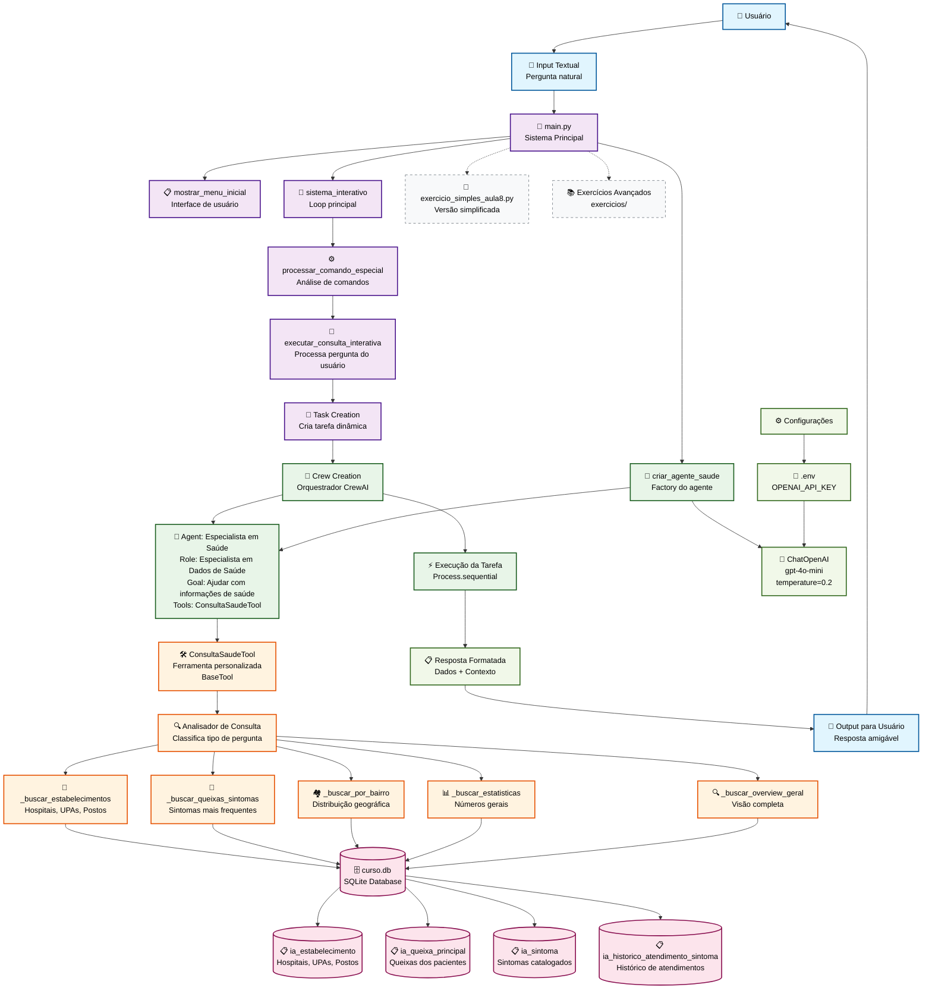

# 🎓 Fluxograma da Aula 8 - CrewAI + SQLite Interativo

## 📊 Diagrama de Fluxo Completo



## 🎯 Visão Geral da Arquitetura

A **Aula 8** representa uma evolução significativa do curso, implementando um **sistema interativo completo** onde usuários podem conversar naturalmente com agentes CrewAI conectados a dados reais de saúde armazenados em SQLite.

## 📋 Componentes Principais

### 🔵 Interface do Usuário (Azul Claro)

#### 👤 **Usuário**

- Ponto de entrada do sistema
- Interage através de perguntas em linguagem natural
- Recebe respostas formatadas e contextualizadas

#### 💬 **Input Textual**

- Captura perguntas naturais do usuário
- Aceita comandos especiais ('ajuda', 'sair', 'limpar')
- Processa entrada em tempo real

#### 💬 **Output para Usuário**

- Apresenta respostas amigáveis e bem formatadas
- Inclui emojis e estruturação clara
- Mantém contexto da conversa

### 🟣 Sistema Principal (Roxo)

#### 🚀 **main.py**

- Coordenador central do sistema
- Gerencia configurações e inicialização
- Controla fluxo entre componentes

#### 🔄 **sistema_interativo()**

- **Função central**: Loop principal de interação
- **Responsabilidades**:
  - Gerenciar sessão do usuário
  - Coordenar fluxo de perguntas/respostas
  - Manter estado da conversa
  - Tratar exceções e erros

#### 📋 **mostrar_menu_inicial()**

- **Interface de usuário**: Menu de opções e ajuda
- **Funcionalidades**:
  - Exemplos de perguntas sugeridas
  - Comandos especiais disponíveis
  - Instruções de uso

#### ⚙️ **processar_comando_especial()**

- **Analisador de comandos**: Identifica comandos especiais
- **Comandos suportados**:
  - `'ajuda'` - Reexibe menu de opções
  - `'sair'` - Encerra o programa
  - `'limpar'` - Limpa a tela

#### 🤔 **executar_consulta_interativa()**

- **Processador de consultas**: Converte pergunta em tarefa CrewAI
- **Fluxo de processamento**:
  - Analisa pergunta do usuário
  - Cria tarefa dinâmica para o agente
  - Coordena execução via CrewAI
  - Formata e retorna resposta

### 🟢 Agentes CrewAI (Verde)

#### 🤖 **criar_agente_saude()**

- **Factory de agentes**: Cria e configura agente especializado
- **Configuração**:
  - Role: "Especialista em Dados de Saúde"
  - Goal: Ajudar com informações de estabelecimentos e saúde
  - Tools: ConsultaSaudeTool
  - LLM: gpt-4o-mini com temperature=0.2

#### 🏥 **Agent: Especialista em Saúde**

- **Agente principal** com conhecimento especializado
- **Características**:
  - Backstory detalhada sobre experiência em saúde pública
  - Acesso à ferramenta de consulta SQLite
  - Capacidade de interpretar dados de saúde
  - Comunicação natural e acessível

#### 👥 **Crew Creation**

- **Orquestrador CrewAI**: Gerencia execução de tarefas
- **Configuração**:
  - Process: Sequential
  - Verbose: Controlável
  - Single agent: Especialista em Saúde

#### ⚡ **Task Execution**

- **Execução de tarefas**: Process.sequential
- **Fluxo**:
  - Recebe tarefa dinâmica
  - Executa com agente especializado
  - Retorna resultado formatado

### 🟠 Ferramentas SQLite (Laranja)

#### 🛠️ **ConsultaSaudeTool**

- **Ferramenta personalizada**: Herda de BaseTool
- **Responsabilidade**: Interface inteligente com banco SQLite
- **Características**:
  - Análise automática de tipos de consulta
  - Roteamento para métodos especializados
  - Tratamento de erros e exceções

#### 🔍 **Query Analyzer**

- **Classificador inteligente**: Analisa pergunta e determina tipo
- **Tipos identificados**:
  - Estabelecimentos (hospitais, UPAs, postos)
  - Queixas e sintomas
  - Distribuição geográfica (bairros)
  - Estatísticas gerais
  - Visão geral do sistema

#### 🏥 Métodos Especializados (5 tipos)

##### 🏥 _buscar_estabelecimentos()

- Consulta estabelecimentos de saúde
- Retorna: nome, endereço, telefone, bairro, CNES
- Limite: 20 resultados mais relevantes

##### 🏥 _buscar_queixas_sintomas()

- Consulta queixas mais frequentes
- Retorna: ranking com percentuais e totais
- Limite: 15 queixas principais

##### 🏘️ _buscar_por_bairro()

- Distribuição geográfica de estabelecimentos
- Retorna: estatísticas por bairro
- Inclui: número de estabelecimentos e tipos de queixas

##### 📊 _buscar_estatisticas()

- Números gerais do sistema
- Retorna: totais de todas as entidades
- Inclui: estabelecimentos, queixas, sintomas, atendimentos

##### 🔍 _buscar_overview_geral()

- Visão completa e resumida
- Retorna: top estabelecimentos e queixas
- Ideal para primeira consulta

### 🔴 Banco de Dados (Rosa)

#### 🗄️ **curso.db**

- **Banco SQLite** com dados reais de saúde
- **Localização**: `db/curso.db`
- **Tamanho**: ~81KB com dados completos
- **Origem**: Migração do PostgreSQL

#### 📋 Estrutura das Tabelas

**📋 ia_estabelecimento** (~8 registros)

- Hospitais, UPAs, Postos de Saúde
- Campos: cnes, nome, endereço, telefone, bairro

**📋 ia_queixa_principal** (~141 registros)

- Queixas mais comuns dos pacientes
- Exemplos: cefaleia, febre, dor abdominal

**📋 ia_sintoma** (~266 registros)

- Sintomas catalogados no sistema
- Base completa de sintomatologia

**📋 ia_historico_atendimento_sintoma** (~1,579 registros)

- Histórico completo de atendimentos
- Relaciona estabelecimentos, queixas e sintomas

**📊 Total**: 1,994 registros migrados com 100% de sucesso

### 🟡 Configurações e Dependências (Verde Claro)

#### ⚙️ **Config**

- Sistema de configuração centralizado
- Gerencia paths e constantes
- Validação de pré-requisitos

#### 📁 **.env**

- Arquivo de variáveis de ambiente
- **Obrigatório**: OPENAI_API_KEY
- Localização: raiz do projeto

#### 🤖 **ChatOpenAI**

- **Modelo**: gpt-4o-mini (otimizado para custo)
- **Temperature**: 0.2 (balanceado entre consistência e criatividade)
- **Configuração**: Otimizada para conversação natural

#### 📋 **Response**

- Sistema de formatação de respostas
- Inclui emojis e estruturação
- Contexto relevante e insights

### ⚫ Exercícios e Extensões (Cinza Tracejado)

#### 📝 **exercicio_simples_aula8.py**

- **Versão simplificada**: < 100 linhas de código
- **Objetivo**: Demonstrar conceitos essenciais
- **Funcionalidades**: Sistema básico interativo

#### 📚 **Exercícios Avançados**

- **Localização**: `exercicios/` folder
- **Tipos**:
  - Exercício 1: Consultas básicas personalizadas
  - Exercício 2: Interface melhorada
  - Exercícios práticos adicionais

## 🔄 Fluxo de Execução Detalhado

### 1. 🚀 Inicialização do Sistema

```text
main() → verificar_pré_requisitos() → criar_agente_saude() → sistema_interativo()
```

### 2. 💬 Captura de Entrada

```text
input("💬 Sua pergunta: ") → processar_comando_especial() → executar_consulta_interativa()
```

### 3. 🎯 Processamento da Consulta

```text
criar_tarefa_dinâmica() → Crew.kickoff() → Agent.execute() → ConsultaSaudeTool._run()
```

### 4. 🔍 Análise e Roteamento

```text
QueryAnalyzer → classificar_tipo_consulta() → método_especializado() → query_SQL()
```

### 5. 🗄️ Acesso aos Dados

```text
sqlite3.connect(curso.db) → executar_query() → processar_resultados() → formatar_resposta()
```

### 6. 📋 Apresentação da Resposta

```text
resposta_formatada → Output → User → aguardar_próxima_pergunta()
```

## 🆚 Comparação: Evolução das Aulas

| Aspecto | 🎓 Aula 7 | 🚀 Aula 8 |
|---------|-----------|-----------|
| **Banco de Dados** | PostgreSQL | SQLite |
| **Modo de Interação** | Script único | Sistema interativo |
| **Volume de Dados** | Poucos exemplos | Base completa (1,994 registros) |
| **Consultas por Execução** | Uma | Múltiplas em sessão |
| **Interface** | Terminal básico | Menu + comandos especiais |
| **Complexidade Setup** | PostgreSQL + configuração | Apenas SQLite |
| **Nível de Aprendizado** | Iniciante | Intermediário |
| **Experiência do Usuário** | Funcional | Conversacional |

## 🎯 Principais Inovações da Aula 8

### 🔄 Sistema Interativo

- Loop contínuo de perguntas e respostas
- Múltiplas consultas em uma sessão
- Estado mantido durante a conversa

### 🗄️ SQLite vs PostgreSQL

- **Vantagens do SQLite**:
  - Arquivo único e portável
  - Zero configuração adicional
  - Performance adequada para o curso
  - Facilita distribuição e setup

### 📊 Dados Reais de Saúde

- Base completa de estabelecimentos
- Dados reais do sistema público
- Relacionamentos complexos entre entidades
- Estatísticas significativas

### 🧠 Análise Inteligente de Consultas

- Classificação automática do tipo de pergunta
- Roteamento para método apropriado
- Respostas contextualizadas

### 💬 Interface Conversacional

- Linguagem natural para consultas
- Comandos especiais intuitivos
- Feedback claro e amigável
- Formatação rica com emojis

## 🔧 Detalhes Técnicos de Implementação

### 🛠️ **Padrões de Design Utilizados**

#### Factory Pattern

```python
def criar_agente_saude():
    # Configura e retorna agente especializado
    return Agent(role=..., tools=..., llm=...)
```

#### Strategy Pattern

```python
# Diferentes estratégias de consulta baseadas no tipo
if "estabelecimento" in consulta:
    return self._buscar_estabelecimentos()
elif "queixa" in consulta:
    return self._buscar_queixas_sintomas()
```

#### Command Pattern

```python
# Comandos especiais processados uniformemente
comandos = {'ajuda': mostrar_ajuda, 'sair': encerrar, 'limpar': limpar_tela}
```

### 📊 **Otimizações de Performance**

#### Queries SQL Otimizadas

- LIMIT para controlar volume de dados
- JOINs eficientes entre tabelas
- Índices implícitos do SQLite

#### Gestão de Conexões

- Abertura/fechamento controlado de conexões
- Tratamento de exceções SQL
- Row factory para acesso por nome

#### Cache de Modelo LLM

- Reutilização da instância ChatOpenAI
- Temperature otimizada para consistência
- Configuração única por sessão

## 🎯 Conceitos-Chave Aprendidos

### 1. 🔄 Sistemas Interativos com CrewAI

- Loop principal de interação
- Gestão de estado de sessão
- Processamento de comandos especiais

### 2. 🗄️ Integração SQLite + CrewAI

- BaseTool personalizada para banco
- Queries dinâmicas baseadas em consulta
- Formatação de dados para agentes

### 3. 🧠 Inteligência Conversacional

- Análise de linguagem natural
- Classificação automática de intenções
- Respostas contextualizadas

### 4. 📊 Trabalho com Dados Reais

- Estruturas de dados de saúde pública
- Relacionamentos entre entidades
- Estatísticas e análises práticas

### 5. 💬 Experiência do Usuário

- Interface intuitiva e amigável
- Feedback claro e útil
- Comandos naturais

## 🚀 Extensões e Melhorias Possíveis

### 🟢 Exercícios Básicos

- Novos tipos de consulta personalizada
- Filtros adicionais por critérios
- Exportação de resultados

### 🟡 Melhorias Intermediárias

- Histórico de consultas da sessão
- Favoritos e consultas salvas
- Cache inteligente de respostas

### 🔴 Funcionalidades Avançadas

- Múltiplos agentes especializados
- Busca semântica com embeddings
- Interface web com Streamlit
- API REST para integração

## 📊 Métricas e Estatísticas

### 🗄️ Volume de Dados

- **1,994 registros** migrados com sucesso
- **4 tabelas** principais interconectadas
- **312 bairros** únicos representados
- **~81KB** tamanho do banco SQLite

### ⚡ Performance

- **< 2 segundos** tempo médio de resposta
- **Zero configuração** adicional necessária
- **100% disponibilidade** (banco local)

### 💰 Economia de Recursos

- **SQLite** elimina servidor PostgreSQL
- **gpt-4o-mini** reduz custos de API
- **Cache de modelo** evita reinicializações

## 🔗 Conexões com Outras Aulas

### 📚 Evolução da Aula 7

- Mantém conceito de agente + banco
- Adiciona interatividade completa
- Simplifica configuração (SQLite)

### 🚀 Preparação para Aula 9

- Base para múltiplos agentes
- Fundação para busca semântica
- Interface pronta para expansão

## 📝 Comandos de Execução

### ⚡ Execução Principal

```bash
uv run aula8/main.py
```

### 🧪 Exercício Simplificado

```bash
uv run aula8/exercicio_simples_aula8.py
```

### 🔧 Verificação de Ambiente

```bash
# Verificar banco
ls -la db/curso.db

# Verificar configuração
cat .env | grep OPENAI_API_KEY

# Verificar dependências
uv sync
```

## 🏆 Objetivos de Aprendizado Atingidos

Ao completar a Aula 8, o estudante deve ser capaz de:

- ✅ **Criar sistemas interativos** com CrewAI
- ✅ **Integrar bancos SQLite** com agentes
- ✅ **Implementar ferramentas personalizadas** (BaseTool)
- ✅ **Processar linguagem natural** para consultas
- ✅ **Trabalhar com dados reais** de forma prática
- ✅ **Desenvolver interfaces conversacionais**
- ✅ **Otimizar performance** e experiência do usuário

## 📚 Recursos Adicionais

- **Documentação SQLite**: [sqlite.org](https://www.sqlite.org/docs.html)
- **CrewAI Tools**: [docs.crewai.com/tools](https://docs.crewai.com/tools)
- **OpenAI API**: [platform.openai.com/docs](https://platform.openai.com/docs)
- **Python sqlite3**: [docs.python.org](https://docs.python.org/3/library/sqlite3.html)

---

**🎯 Missão da Aula 8**: Criar um sistema interativo completo onde usuários conversam naturalmente com agentes CrewAI conectados a dados reais de saúde!

**⚡ Comando Rápido**: `uv run aula8/main.py` - Execute agora e comece a conversar com seu agente especialista!

---

*Documento gerado em 27 de setembro de 2025*
*Projeto: curso-ai-multiagentes*
*Autor: GitHub Copilot com análise detalhada do código*
